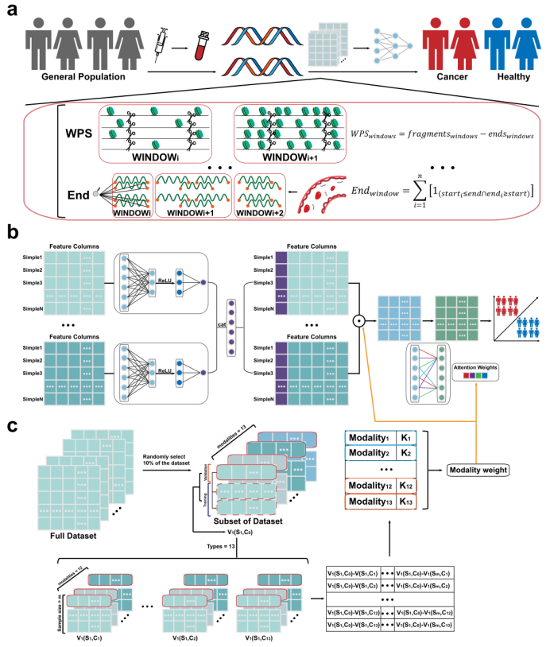

# Enhanced Early Cancer Detection via Multi-Omics cfDNA Fragmentation Integration Using an Early-Late Fusion Neural Network with Sample-Modality Evaluation
Multi-omics cfDNA fragmentation patterns show promise as biomarkers for early cancer detection, but fusing their multimodal data faces challenges from heterogeneity and small sample sizes. We propose ELSM, a framework integrating two-stage neural network fusion with sample-modality evaluation to effectively combine 13 cfDNA fragmentomic features. Evaluated across five datasets (1,994 samples, 10 cancer types), ELSM outperforms both unimodal classifiers and state-of-the-art fusion models in cancer detection and tissue-of-origin prediction. Biological analysis of key genomic regions linked to high-contributing modalities validates biological relevance, highlighting ELSM’s clinical utility.

 width="180" height="105"/>

